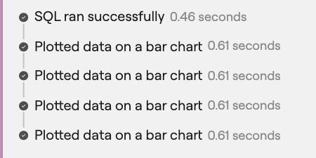
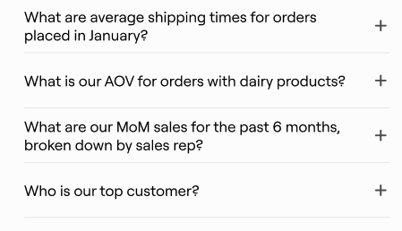
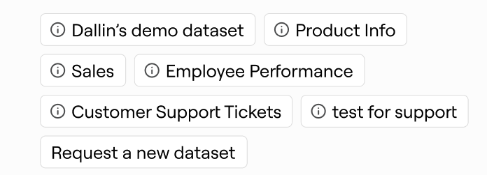

# AppMarkdown Web Components

The AppMarkdown component supports various custom web components that can be used within markdown content. These components accept different props to customize their behavior and appearance.

Currently we accept the markdown through the stream at `/threads/post:generatingResponse` with a payload of

```json
{
  thread_id: string;
  message_id: string;
  progress: 'completed' | 'inProgress';
  markdown: string;
  markdown_chunk: string;
}
```

You can test out the stream at `localhost:3000/test/markdown/stream`

## BusterTimestamp

> The `<buster-timestamp>` component displays a timestamp with a title and duration.

| Prop Name    | Type                        | Description                                  |
| ------------ | --------------------------- | -------------------------------------------- |
| title        | string                      | The title or description of the timestamp    |
| milliseconds | string (optional)           | The duration in milliseconds                 |
| id           | string                      | Optional unique identifier for the timestamp |
| status       | 'inProgress' \| 'completed' | The current status of the timestamp          |

```
<buster-timestamp status="completed" id="123-abc-xyz-doh-rey-me" title="SQL ran successfully" milliseconds="457"></buster-timestamp>
```



## BusterSuggestion

> The `<buster-suggestion> components displays a suggested follow up question

| Prop Name   | Type   | Description                                                |
| ----------- | ------ | ---------------------------------------------------------- |
| suggestions | string | A JSON string representing an array of suggestions objects |

Each suggestion object in the JSON string should have the following structure when it is parsed:

| Property    | Type              | Description                          |
| ----------- | ----------------- | ------------------------------------ |
| id          | string            | Unique identifier for the suggestion |
| title       | string            | Title of the suggestion              |
| description | string (optional) | Description of the suggestion        |

Example usage:

```
<buster-suggestion suggestions='[{"id": "123", "title": "This is a suggestion example", "description": "This is a description example"}, {"id": "123-abc-xyz-doh-rey-me", "title": "CSV file", "description": "This is a description example"}]'></buster-suggestion>
```



## BusterDatasets

> The `<buster-datasets>` component displays a list of datasets with their names and optional descriptions.

| Prop Name | Type   | Description                                            |
| --------- | ------ | ------------------------------------------------------ |
| datasets  | string | A JSON string representing an array of dataset objects |

Each dataset object in the JSON string should have the following structure when it is parsed:

| Property    | Type              | Description                       |
| ----------- | ----------------- | --------------------------------- |
| id          | string            | Unique identifier for the dataset |
| title       | string            | Name of the dataset               |
| description | string (optional) | Description of the dataset        |

Example usage:

```
<buster-datasets datasets='[{"id": "123", "description": "CSV file", "name": "CSV file"}, {"id": "123-abc-xyz-doh-rey-me", "description": "CSV file", "name": "CSV file"}]'></buster-datasets>
```


